# AgentOdyssey 长程自进化实验报告

本报告汇总当前已经完成的 AgentOdyssey 实验，并严格遵守“同一游戏内比较”的原则。Metropolis、Remnant 与 Mark 是三个不同的游戏任务，因此不把它们的分数放在同一张性能比较表中，也不把不同任务的曲线叠加解释为方法优劣。

## 1. 实验范围与比较原则

当前可用于分析的完整轨迹均为 Qwen3-4B、seed=42、最多 500 个 environment steps。Metropolis 现在已有五种可对照方法：Environment-prediction TTT、SFT + Short-Term Memory、Feedback-to-Policy TTT（F2P-TTT）、Lookahead Environment-TTT，以及已完成 500 步的 Hindsight Long-Horizon TTT v1；Remnant 和 Mark 当前已有前四种方法。各任务分别独立比较，不进行跨任务排名。

报告同时使用两类指标。第一类是环境日志中记录的 reward breakdown，包括 quest、exploration、craft、kill、unique_kill、side_quest、trade 和 death；第二类是行为诊断，包括 invalid action、失败事件、动作重复、动作空间覆盖、决策延迟、上下文长度、历史引用以及 `predicted_outcome` 覆盖率。行为诊断用于解释模型如何成功或失败，不能替代 benchmark 官方定义的聚合分数。

## 2. 方法的基本逻辑

Environment-prediction TTT 在每一步根据历史生成动作，并额外尝试预测执行该动作之后的环境变化。环境返回真实 observation 后，使用真实 transition 对 LoRA 做环境预测训练，目标可写成：

\[
\mathcal{L}_{env}=-\log p_\theta(o_{t+1}\mid H_t,a_t).
\]

SFT + Short-Term Memory 把最近交互整理成文本记忆，并用这些近期交互对 LoRA 做监督微调。它更直接地训练模型复现近期的 reasoning、action 和交互模式；它能看到历史，但看到历史不等于自动把历史失败转化为稳定的状态约束。

F2P-TTT 保留动作生成、后果预测和真实环境反馈。模型先生成动作 \(a_t\) 与预测后果 \(\hat o_{t+1}\)，环境执行动作并返回真实结果 \(o_{t+1}\)，然后根据预测结果与真实结果对动作的后见支持差异得到 \(w_t\)，最后使用原定损失更新 LoRA：

\[
\mathcal{L}^{F2P}_t=-w_t\frac{1}{L_t}\log P_\theta(a_t\mid H_t).
\]

当前实现保持损失函数和原始生成长度不变，只对反向计算进行逐样本累积，避免同时保留多个计算图导致 OOM。F2P 的原始 response、预测结果、真实 observation、\(\delta_t\)、\(w_t\)、LoRA 更新次数和 transition 均被单独记录。

Lookahead Environment-TTT 是本轮新增的轻量版本。它先根据 \(H_t\) 生成初始动作 \(a_t^{(0)}\)，再预测该动作的环境后果 \(\hat o_{t+1}^{(0)}\)，把这段后果放回上下文后重新生成修正动作 \(a_t^{(1)}\)，最后对真正执行的修正动作再生成一次后果预测 \(\hat o_{t+1}^{(1)}\)，并执行 \(a_t^{(1)}\)：

\[
H_t\rightarrow a_t^{(0)}\rightarrow \hat o_{t+1}^{(0)}\rightarrow a_t^{(1)}\rightarrow \hat o_{t+1}^{(1)}\rightarrow o_{t+1}^{real}.
\]

训练仍然只使用真实 transition 的原始环境预测损失 \(\mathcal{L}_{env}=-\log p_\theta(o_{t+1}^{real}\mid H_t,a_t^{(1)})\)，没有新增 loss、价值模型或额外奖励。每一步额外记录初始动作、初始预测、修正动作、修正预测、最终执行动作预测、真实 observation、是否触发 LoRA 更新和更新前后步数，因此可以区分“模型没有输出预测”“预测输出未被解析”“预测改变了动作”和“真实反馈训练了模型”这几个环节。

Hindsight Long-Horizon TTT v1 与 Lookahead 的作用点不同：它不在动作执行前重选动作，而是在真实轨迹形成后，用后续真实未来重新评价已经执行的动作。对第 (t) 步动作记录普通上下文下的动作对数概率 \(\ell_t^{prior}\)，再在加入真实后续窗口 \(F_{t,K}\) 后计算 \(\ell_t^{hind}\)，得到 hindsight evidence：

\[
e_t=\ell_t^{hind}-\ell_t^{prior}.
\]

它再用轨迹反馈 (R) 与证据共同形成动作更新信号 \(A_t=R\,e_t\)，并将其用于原有动作策略损失。该方法保留同一个 Qwen3-4B 与同一个 LoRA，但需要在真实未来出现后才进行反向 credit assignment，因此它检验的是“长期结果能否回头改变动作策略”，而不是“预测后果能否立即改变当前动作”。

## 3. 结果总览

下图是最新生成的结果总览。三个面板分别展示 Metropolis、Remnant 和 Mark；Metropolis 面板包含五种方法，Remnant 和 Mark 面板包含各自已经完成的四种方法。不同面板不是跨游戏比较。

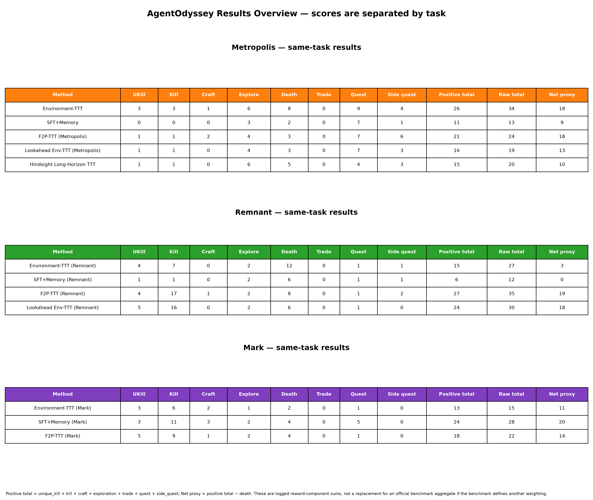

### 3.1 Metropolis：同任务五方法完整结果

| 指标 | Environment-prediction TTT | SFT + Short-Term Memory | F2P-TTT | Lookahead Environment-TTT | Hindsight Long-Horizon TTT v1* |
|---|---:|---:|---:|---:|---:|
| Environment steps | 500 | 500 | 500 | 500 | 500 |
| Quest | 9 | 7 | 7 | 7 | 4 |
| Exploration | 6 | 3 | 4 | 4 | 6 |
| Craft | 1 | 0 | 2 | 0 | 0 |
| Kill | 3 | 0 | 1 | 1 | 1 |
| Unique kill | 3 | 0 | 1 | 1 | 1 |
| Side quest | 4 | 1 | 6 | 3 | 3 |
| Trade | 0 | 0 | 0 | 0 | 0 |
| Death | 8 | 2 | 3 | 3 | 5 |
| 正向奖励合计（不含 death） | 26 | 11 | 21 | 16 | 15 |
| 原始奖励合计（含 death） | 34 | 13 | 24 | 19 | 20 |
| 净奖励代理值（正向奖励−death） | 18 | 9 | 18 | 13 | 10 |
| Invalid action | 16（3.2%） | 47（9.4%） | 32（6.4%） | 35（7.0%） | 31（6.2%） |
| Failure events | 210（42.0%） | 294（58.8%） | 234（46.8%） | 221（44.2%） | 204（40.8%） |
| 立即重复率 | 2.2% | 6.4% | 2.6% | 2.4% | 1.2% |
| 最近窗口重复率 | 9.6% | 17.6% | 11.2% | 10.0% | 9.8% |
| 不同精确动作数 | 152 | 183 | 148 | 142 | 163 |
| 平均决策时间 | 23.0 秒 | 58.5 秒 | 23.9 秒 | 80.3 秒 | 21.5 秒 |
| 平均输入 token | 2608 | 1696 | 3475 | 7926 | 2454 |
| 平均输出 words | 592 | 574 | 550 | 1697 | 454 |
| 历史引用率 | 99.2% | 96.4% | 98.2% | 100.0% | 99.4% |
| predicted_outcome 覆盖率 | 7.2% | 0%（不适用） | 3.0% | 57.8%（最终预测） | 5.0%（记录字段） |

\* Hindsight v1 是已完成的历史轮次；由于后续轮次修正了实现与运行配置，不能把它直接视为最终公平排名。

这里的“正向奖励合计”是日志中 `unique_kill + kill + craft + exploration + trade + quest + side_quest` 的原始计数之和；“原始奖励合计”再加上 death；“净奖励代理值”则从正向奖励中减去 death。它们用于完整展示日志里的各个分量，不应替代 benchmark 官方可能采用的加权总分。尤其是 `kill` 与 `unique_kill` 是否在官方汇总中重复计入，应以 benchmark 的正式评分实现为准。

Metropolis 的总体行为是：Environment-prediction TTT 有最高的 quest 和 exploration，但死亡也最多；SFT + Memory 死亡最少，却有最高的 invalid action、失败事件和局部重复；F2P-TTT 的死亡低于 Environment-prediction TTT，探索和 craft 高于 SFT，但 `predicted_outcome` 覆盖率仍低。Lookahead 的失败率和重复率略低于 F2P，最终预测覆盖率明显提高到 57.8%，但平均输入长度达到 7926 token、平均决策时间达到 80.3 秒，且 quest、craft 和净奖励代理值没有超过原始 Environment-TTT/F2P，说明“预测进入动作修正”已经生效，但当前实现的计算代价很高，预测还没有稳定转化为更高的任务收益。

Metropolis 的 Hindsight Long-Horizon TTT v1 完成了 500 步。它的 failure events 为 204（40.8%），是当前五种方法中最低；立即重复率为 1.2%，也是最低；invalid action 为 6.2%，低于 Lookahead 和 F2P；不同精确动作数为 163，说明行为并未塌缩到单一动作。然而，这些行为改善没有转化为更高的任务推进：quest=4、净奖励代理值=10，低于 Environment-prediction TTT/F2P 的 18。中间记录显示 499 个 hindsight credit 中有 433 个 (A_t=0)，只有 31 个正值和 35 个负值，平均 (e_t=0.860)、平均 (R=0.084)、平均 (A_t=-0.030)，实际 policy update 仅 99 次。因此 v1 更像是“长期 credit 信号稀疏且策略更新较保守”的完整可运行结果，而不是已经证明长期 hindsight 能提升任务分数的结果。

需要特别注明：表中的 Hindsight v1 是已完成的历史轮次，用于展示当前效果和诊断机制；它不是修正版 v2/v3/v4 的最终结果。v1 与其他方法在生成长度、上下文处理和实现修正时点上可能存在差异，正式的公平比较应在统一配置下重新完成 Hindsight 轮次。仓库保留 `raw/hindsight_metropolis_v1_agent_log.jsonl` 主轨迹；Hindsight 中间产出文件未纳入仓库，以控制体积并避免把临时中间结果作为复现必需输入。

### 3.2 Remnant：同任务四方法完整结果

| 指标 | Environment-prediction TTT | SFT + Short-Term Memory | F2P-TTT | Lookahead Environment-TTT |
|---|---:|---:|---:|---:|
| Environment steps | 500 | 500 | 500 | 500 |
| Quest | 1 | 1 | 1 | 1 |
| Exploration | 2 | 2 | 2 | 2 |
| Craft | 0 | 0 | 1 | 0 |
| Kill | 7 | 1 | 17 | 16 |
| Unique kill | 4 | 1 | 4 | 5 |
| Side quest | 1 | 1 | 2 | 0 |
| Trade | 0 | 0 | 0 | 0 |
| Death | 12 | 6 | 8 | 6 |
| 正向奖励合计（不含 death） | 15 | 6 | 27 | 24 |
| 原始奖励合计（含 death） | 27 | 12 | 35 | 30 |
| 净奖励代理值（正向奖励−death） | 3 | 0 | 19 | 18 |
| Invalid action | 42（8.4%） | 11（2.2%） | 24（4.8%） | 21（4.2%） |
| Failure events | 195（39.0%） | 358（71.6%） | 207（41.4%） | 184（36.8%） |
| 立即重复率 | 4.0% | 57.0% | 6.2% | 8.4% |
| 最近窗口重复率 | 16.8% | 67.6% | 21.0% | 23.0% |
| 不同精确动作数 | 145 | 78 | 157 | 134 |
| 平均决策时间 | 33.6 秒 | 69.1 秒 | 20.8 秒 | 67.7 秒 |
| 平均输入 token | 2421 | 1500 | 3262 | 7568 |
| 平均输出 words | 664 | 887 | 523 | 1742 |
| predicted_outcome 覆盖率 | 15.6% | 0%（不适用） | 17.0% | 72.4%（最终预测） |

Remnant 的四方法结果可以在本任务内部直接比较，但不能和 Metropolis 的总和直接比较。Remnant 的四方法行为对比图也已单独生成，所有曲线都只来自 Remnant：

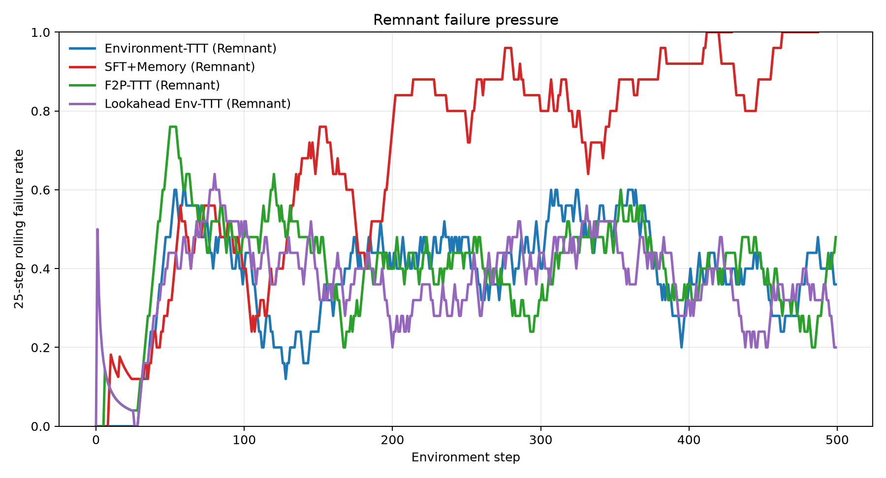

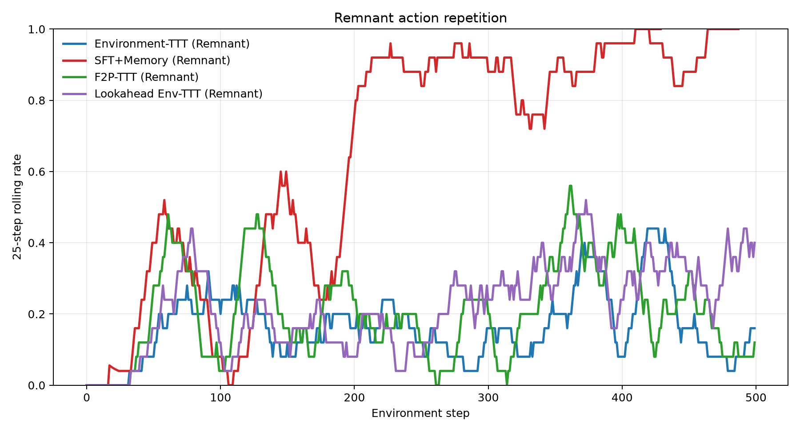

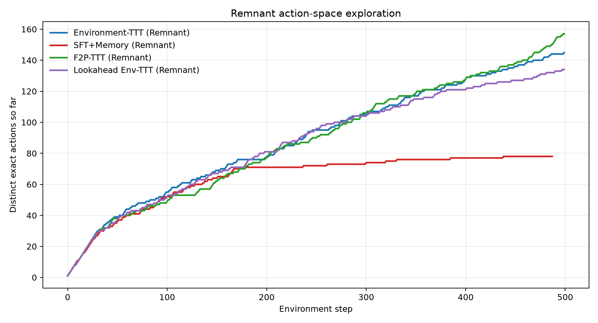

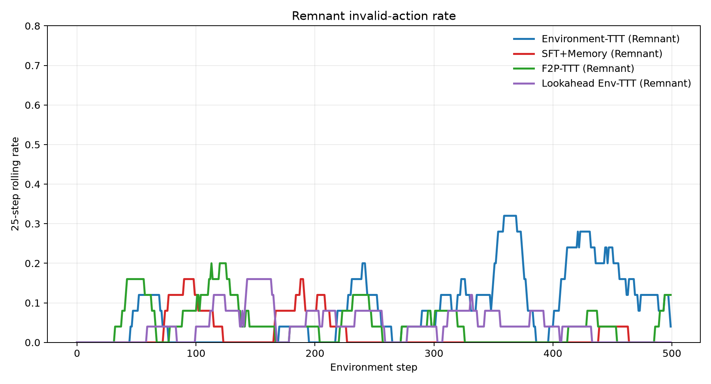

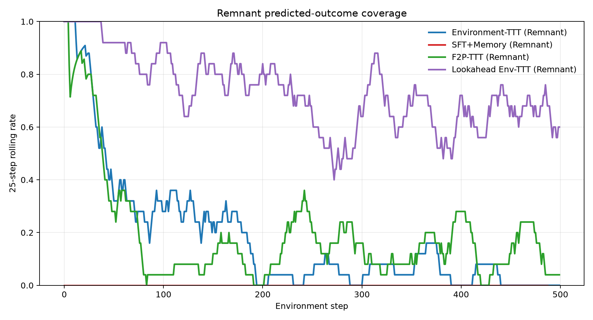

四方法的汇总分数和行为指标完整保存在 `outputs/summary_remnant.csv`。Lookahead 的初始预测、修正预测和最终执行动作预测是不同阶段，不能只用最终覆盖率推断前两阶段一定有效；专项诊断见下图：

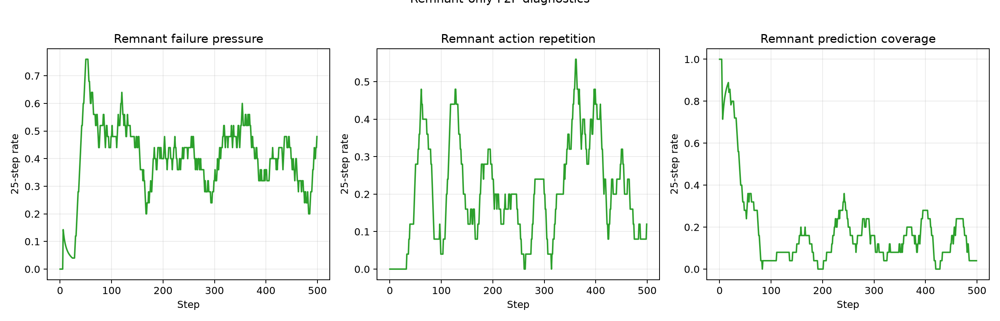

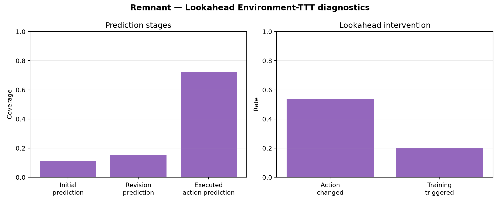

### 3.3 Lookahead Environment-TTT：新增阶段诊断

这一轮新增方法的关键不是只看最终分数，而是检查“初始动作 → 后果预测 → 修正动作”是否真的发生。下面两个表和图严格按游戏分开。这里的 `training updates` 是 LoRA 优化器步数累计增量；`training trigger rate` 是每一步是否触发真实 transition 训练，而不是额外的奖励信号。

#### Remnant：Lookahead 专项统计

| 指标 | 数值 |
|---|---:|
| Environment steps | 500 |
| 初始后果预测覆盖率 | 11.2% |
| 修正阶段后果预测覆盖率 | 15.2% |
| 最终执行动作后果预测覆盖率 | 72.4% |
| 初始动作→修正动作改变率 | 53.8% |
| 触发真实环境预测训练比例 | 20.0% |
| LoRA 更新步数增量 | 600 |

#### Metropolis：Lookahead 专项统计

| 指标 | 数值 |
|---|---:|
| Environment steps | 500 |
| 初始后果预测覆盖率 | 3.0% |
| 修正阶段后果预测覆盖率 | 7.6% |
| 最终执行动作后果预测覆盖率 | 57.8% |
| 初始动作→修正动作改变率 | 51.6% |
| 触发真实环境预测训练比例 | 20.0% |
| LoRA 更新步数增量 | 600 |

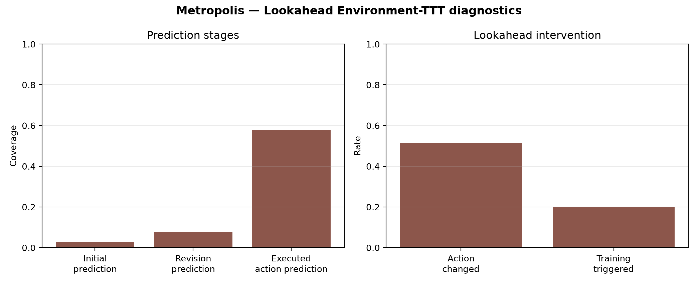

这组统计支持一个有限但清晰的结论：Lookahead 的第二次动作决策确实经常不同于第一次，说明预测文本被送回了 policy；但初始和修正阶段的预测字段覆盖率仍低，尤其是 Metropolis，说明模型经常没有按协议输出可解析的后果预测。最终覆盖率较高，部分原因是最终预测提示更明确，不能单独当作“预测正确率”。

### 3.4 Mark：同任务四方法完整结果

| 指标 | Environment-prediction TTT | SFT + Short-Term Memory | F2P-TTT | Lookahead Environment-TTT |
|---|---:|---:|---:|---:|
| Environment steps | 500 | 500 | 500 | 500 |
| Quest | 1 | 5 | 1 | 1 |
| Exploration | 1 | 2 | 2 | 2 |
| Craft | 2 | 3 | 1 | 1 |
| Kill | 6 | 11 | 9 | 9 |
| Unique kill | 3 | 3 | 5 | 4 |
| Side quest | 0 | 0 | 0 | 0 |
| Trade | 0 | 0 | 0 | 0 |
| Death | 2 | 4 | 4 | 5 |
| 正向奖励合计（不含 death） | 13 | 24 | 18 | 17 |
| 原始奖励合计（含 death） | 15 | 28 | 22 | 22 |
| 净奖励代理值（正向奖励−death） | 11 | 20 | 14 | 12 |
| Invalid action | 30（6.0%） | 30（6.0%） | 15（3.0%） | 15（3.0%） |
| Failure events | 220（44.0%） | 226（45.2%） | 209（41.8%） | 186（37.2%） |
| 立即重复率 | 2.2% | 10.8% | 2.2% | 1.4% |
| 最近窗口重复率 | 14.8% | 25.8% | 24.2% | 13.2% |
| 不同精确动作数 | 149 | 174 | 129 | 126 |
| 平均决策时间 | 24.1 秒 | 219.4 秒 | 19.4 秒 | 56.8 秒 |
| 平均输入 token | 2346 | 1628 | 3439 | 7521 |
| predicted_outcome 覆盖率 | 14.0% | 0%（不适用） | 12.6% | 75.0%（最终预测） |

#### Mark：Lookahead 阶段与训练诊断

| 诊断量 | Lookahead Environment-TTT |
|---|---:|
| 初始动作后果预测覆盖率 | 10.4% |
| 修正动作后果预测覆盖率 | 15.2% |
| 最终执行动作后果预测覆盖率 | 75.0% |
| 初始动作→修正动作改变率 | 42.4% |
| 真实环境预测训练触发率 | 19.8% |
| LoRA 更新步数增量 | 594 |
| 平均输出长度（运行日志 token） | 1724 |

这里的 Mark Lookahead 行来自 2026-08-28 完成的独立续跑日志；其 `failure events` 是根据 invalid、death 以及 observation 中明确的失败/无效反馈统计的行为诊断，不是 benchmark 官方总分。Mark Lookahead 的阶段统计进一步说明：最终预测字段覆盖率很高，但初始和修正阶段覆盖率仍低，因此不能把 75.0% 直接解释为预测准确率。

Mark 的结果体现了明显的任务依赖性：SFT + Memory 的 quest=5 和净奖励代理值=20 仍然最高；Lookahead 的失败率、立即重复率和最近窗口重复率最低，但死亡数为 5，净奖励代理值为 12，尚未转化为更高的任务推进。它最明显的机制收益是最终后果预测覆盖率提升到 75.0%，并且初始动作到修正动作的改变率为 42.4%，说明后果预测确实进入了动作形成过程，但预测介入还没有稳定变成更好的 Mark 策略。需要注意，Mark 的 SFT 轨迹来自此前保存并续跑的 SFT checkpoint，而 Lookahead 是本轮从历史 LoRA/记忆状态续跑；因此这组结果适合做当前行为与机制对照，正式论文结论仍应进一步统一初始化方式并使用多个 seed。Mark 的四方法图单独保存在 `figures/mark_01_failure_pressure.png` 至 `figures/mark_05_prediction_coverage.png`。

## 4. Metropolis 的长程失败模式

### 4.1 接口格式失败

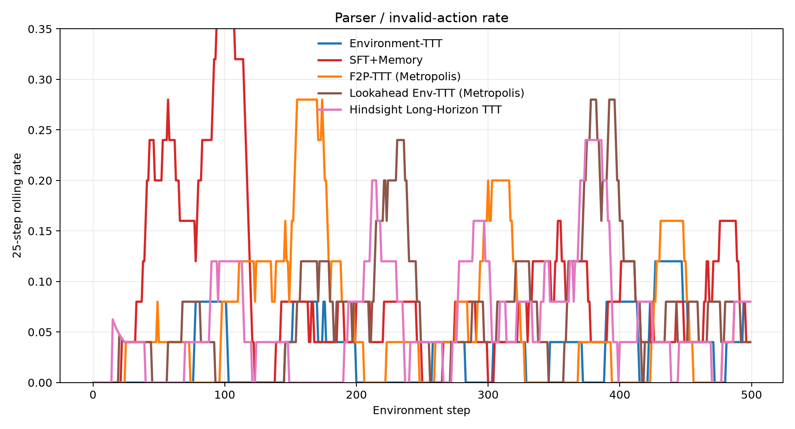

SFT + Memory 的 invalid action 为 47 次，明显高于 Environment-prediction TTT 的 16 次和 F2P-TTT 的 32 次。典型表现是模型生成语义上接近正确动作、但不符合 parser 精确格式的字符串，例如 `pick_up_small_paper`、`equip_key` 或 `pick_up`。这类错误不一定意味着模型完全不理解任务目标，但会消耗一个完整时间步，并可能把后续状态推入更难恢复的轨迹。

### 4.2 失败反馈没有转化为前置条件

环境常返回“没有路径”“材料不足”“没有工具”“对象不在当前位置”等明确反馈。模型下一步有时不再重复完全相同的字符串，却转向另一个同样违反前置条件的动作。这说明模型表面上读取了 observation，但没有稳定形成“位置—背包—工具—NPC 状态”的可执行约束。

### 4.3 局部动作循环

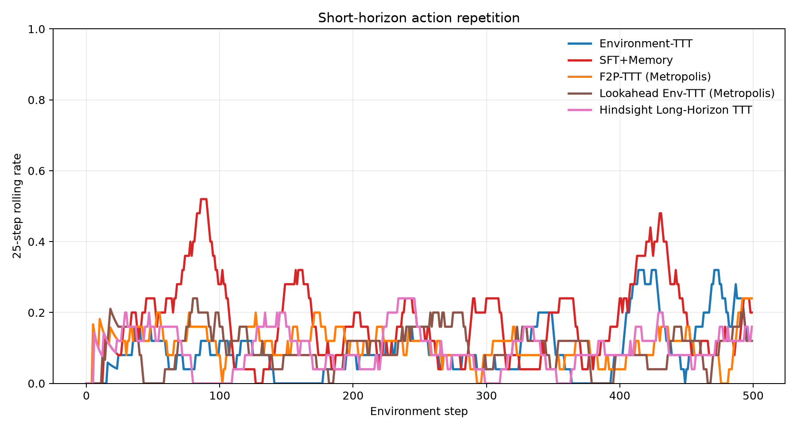

SFT + Memory 的最近窗口重复率为 17.6%，高于 Environment-prediction TTT 的 9.6% 和 F2P-TTT 的 11.2%。F2P-TTT 的重复率较低，但仍会出现 `attack`、`enter` 或 `talk` 的局部循环。判断循环是否有害，不能只看动作是否重复，还要检查重复之后是否产生 quest、探索、craft 或状态变化。

### 4.4 长时间停滞与风险权衡

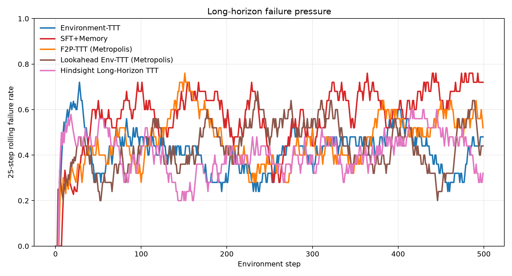

SFT + Memory 的失败事件最多，且无正向事件停滞区间更长；它通过较少的死亡保持了更保守的轨迹，但没有把保守转化为有效推进。Environment-prediction TTT 更积极，quest、exploration 和 kill 都更高，却承担了更多死亡。F2P-TTT 在 Metropolis 中处于两者之间。

## 5. 自进化范式到底学到了什么

SFT + Memory 更像是在近期交互文本上做模式复现。它能保留近期动作和对象，但不一定把“上一次这样做导致环境拒绝”转成稳定的动作约束。Environment-prediction TTT 更接近通过真实 transition 学习动作—后果关系，表现为更少的接口错误和更强的任务推进；但显式 `predicted_outcome` 覆盖率只有 7.2%，不能据此断言预测稳定指导动作。

F2P-TTT 进一步把预测结果和真实结果的差异反馈到动作策略。当前链路已经保存了 \(\delta_t\)、\(w_t\) 和 LoRA 更新记录，但 Metropolis 覆盖率只有 3.0%，Remnant 为 17.0%。因此目前可以确认“实现和记录链路完成”，但还不能确认预测反馈在整个长程轨迹中稳定发挥了策略改进作用。

Lookahead Environment-TTT 验证了另一件更具体的事情：预测确实可以进入策略链路。Remnant 中初始预测覆盖率 11.2%、修正阶段 15.2%、最终执行动作预测 72.4%；Metropolis 中分别为 3.0%、7.6% 和 57.8%；Mark 的最终执行动作预测覆盖率为 75.0%，初始动作到修正动作改变率为 42.4%。这些结果说明第二次决策不是简单复制第一步。然而，预测字段在前两阶段经常为空，且修正动作改变并不等于正确改变；因此目前只能证明“后果信息被注入并影响了动作”，还不能证明它已经学会了可靠的后果推理。

## 6. 速度与计算开销

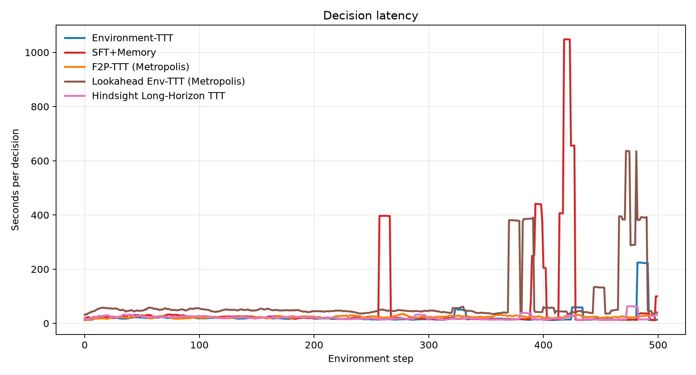

在 Metropolis 上，Environment-prediction TTT 平均每步约 23.0 秒，SFT + Memory 约 58.5 秒，F2P-TTT 约 23.9 秒；Lookahead Environment-TTT 平均每步约 80.3 秒。Lookahead 的平均输入约 7926 token、平均输出约 1697 words，明显高于其他方法，这是每一步执行三次生成调用并把预测文本继续放入上下文的直接代价。Remnant 的 Lookahead 平均约 67.7 秒、7568 input token；本轮 Mark Lookahead 平均约 56.8 秒、7521 input token。该版本改善了预测链路的可观测性，却牺牲了吞吐，且长上下文触发了 transformers 的 40960 长度警告。

## 7. 数据与图表文件

主 Metropolis 五方法汇总表：[outputs/summary_metrics.csv](outputs/summary_metrics.csv)

Remnant 单任务汇总表：[outputs/summary_remnant.csv](outputs/summary_remnant.csv)

Mark 单任务汇总表：[outputs/summary_mark.csv](outputs/summary_mark.csv)

Lookahead Remnant 阶段统计：[outputs/lookahead_diagnostics_remnant.csv](outputs/lookahead_diagnostics_remnant.csv)

Lookahead Metropolis 阶段统计：[outputs/lookahead_diagnostics_metropolis.csv](outputs/lookahead_diagnostics_metropolis.csv)

Metropolis 失败样例：[outputs/failure_cases.jsonl](outputs/failure_cases.jsonl)

Metropolis 代表性案例：[outputs/representative_examples.json](outputs/representative_examples.json)

Remnant 代表性案例：[outputs/representative_examples_remnant.json](outputs/representative_examples_remnant.json)

Mark 代表性案例：[outputs/representative_examples_mark.json](outputs/representative_examples_mark.json)

最新结果总览图：[figures/00_results_overview.png](figures/00_results_overview.png)

Lookahead Remnant 阶段图：[figures/lookahead_remnant_diagnostics.png](figures/lookahead_remnant_diagnostics.png)

Lookahead Metropolis 阶段图：[figures/lookahead_metropolis_diagnostics.png](figures/lookahead_metropolis_diagnostics.png)

Metropolis 的主图 `01`–`13` 现在包含 Metropolis 的五方法；Remnant 使用 `remnant_01`–`remnant_05` 的同任务四方法图；Mark 使用 `mark_01`–`mark_05` 的同任务四方法图，另有 `remnant_diagnostics.png` 用于 F2P 的专项诊断，以及两个 Lookahead 专项阶段图。结果总览图已重新生成并加入 Hindsight Metropolis v1；所有图都在任务内部比较，没有把不同游戏叠加到同一张方法曲线图中。

## 8. 当前结论

在 Metropolis 上，Environment-prediction TTT 的任务推进最强但风险最高；SFT + Memory 更保守，却更容易出现格式错误、局部重复和长程停滞；F2P-TTT 的行为指标总体介于两者之间；Lookahead 的失败率和重复率较低，但生成开销最高，当前净奖励代理值为13，低于 Environment-TTT/F2P 的18。Hindsight v1 的失败和重复指标最低、速度也最快，但 quest=4、净奖励代理值=10，且 (A_t) 大量为零，说明长期 hindsight 信号在当前实现中没有形成足够密集的有效策略更新。Remnant 上 F2P-TTT 的正向事件和净奖励代理值仍最高，Lookahead 以更低死亡和更低失败率接近 F2P，但净奖励代理值为18，略低于 F2P 的19；它的主要优势是最终后果预测覆盖率达到72.4%。Mark 上 SFT + Memory 的主线推进最强（quest=5、净奖励代理值=20）；Lookahead 的失败率、重复率和 invalid action 均较低，最终后果预测覆盖率达到75.0%，但死亡为5、净奖励代理值为12，说明机制链路已生效而任务收益仍不稳定。三个任务共同说明，方法效果高度依赖任务结构，不能用单一游戏结果概括普遍能力。

Metropolis 已增加一条完成 500 步的 Hindsight v1 结果，因此 Metropolis 可在五种方法之间做当前轮次对照；Remnant 和 Mark 仍按四种方法比较。Lookahead 与 Hindsight 目前仍是单一 seed 的新实验，且 Hindsight v1 是历史轮次；结论应视为机制验证而非最终优越性证明。仍然不能把三个游戏的总分直接横向排名，因为它们的状态空间、任务链和奖励触发机会不同。
